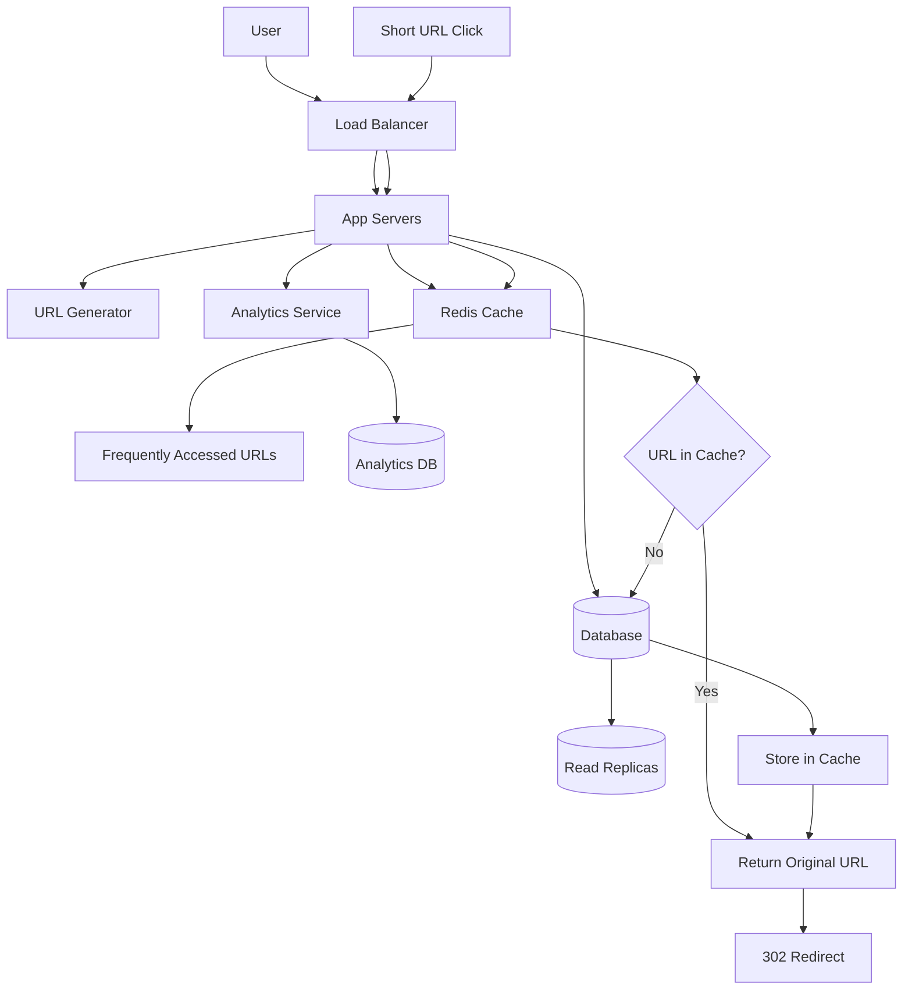
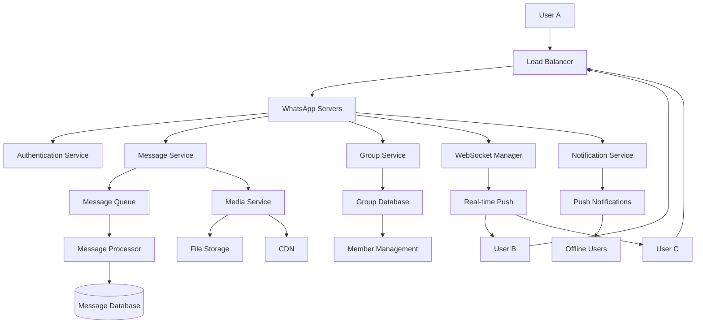
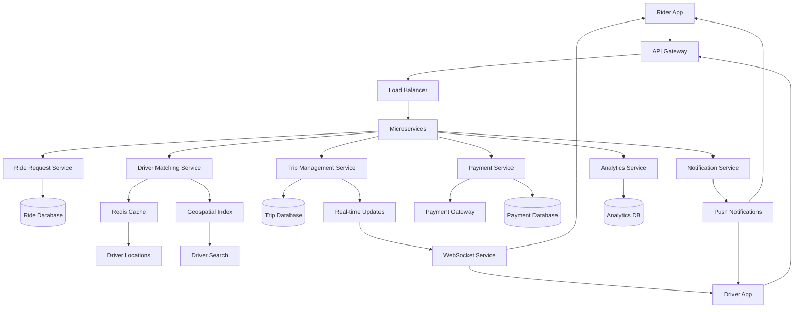

# Monchee Free System Design Pack
## 3 FAANG-Style System Design Problems with Diagrams

**By Monchee.com**

---

## Table of Contents

1. [Design URL Shortener](#design-url-shortener)
2. [Design WhatsApp](#design-whatsapp)
3. [Design Uber](#design-uber)

---

## Design URL Shortener

### Problem Statement

Design a URL shortener service like bit.ly that can convert long URLs into short, shareable links. The service should handle millions of URL shortening requests per day and redirect users to the original URLs when they click on the short links. The system should also provide basic analytics on link usage.

### Functional Requirements

- **Shorten URLs**: Convert long URLs to short, unique identifiers
- **Redirect**: Redirect short URLs to original URLs
- **Custom URLs**: Allow users to create custom short URLs (optional)
- **Analytics**: Track click counts and basic usage statistics
- **Expiration**: Support optional URL expiration dates
- **User Management**: Allow users to manage their shortened URLs

### Non-Functional Requirements

- **High Availability**: 99.9% uptime
- **Low Latency**: Redirect should happen in < 100ms
- **Scalability**: Handle 100M URLs and 1000 requests/second
- **Durability**: Never lose URL mappings
- **Security**: Prevent abuse and malicious URLs

### High-Level Design

The URL shortener follows a simple but scalable architecture. When a user wants to shorten a URL, the request goes through a load balancer to one of many application servers. The server generates a unique short code (using base62 encoding of a unique ID) and stores the mapping in a database. The short URL is returned to the user.

For redirection, when someone clicks a short URL, the request again goes through the load balancer to an application server, which looks up the original URL in the database and returns a 302 redirect response. To handle the high read volume, we use read replicas and caching. A distributed cache (Redis) stores frequently accessed URL mappings to reduce database load and improve response times.

### Diagram

---

## Design WhatsApp

### Problem Statement

Design a real-time messaging system like WhatsApp that can handle billions of messages per day. The system should support one-on-one chats, group chats, message delivery status, and real-time message synchronization across multiple devices. Users should be able to send text, images, videos, and other media files.

### Functional Requirements

- **Send Messages**: Send text, media, and file messages
- **Real-time Delivery**: Messages appear instantly on recipient's device
- **Group Chats**: Support group conversations with multiple participants
- **Message Status**: Show sent, delivered, and read status
- **Media Sharing**: Support images, videos, documents, and voice messages
- **Message History**: Store and retrieve chat history
- **Multi-device Sync**: Messages sync across all user devices
- **Push Notifications**: Notify users of new messages when app is closed

### Non-Functional Requirements

- **Low Latency**: Messages delivered in < 200ms
- **High Throughput**: Handle 50B+ messages per day
- **Scalability**: Support 2B+ users globally
- **Reliability**: 99.99% message delivery rate
- **Security**: End-to-end encryption for message privacy
- **Availability**: 99.9% uptime globally

### High-Level Design

WhatsApp uses a hybrid architecture combining real-time messaging with traditional request-response patterns. When a user sends a message, it goes to the nearest WhatsApp server through a load balancer. The server authenticates the user, stores the message in a database, and immediately pushes it to the recipient's connected device via WebSocket connections.

For group chats, the system uses a fan-out approach where the message is sent to all group members simultaneously. The architecture includes message queues (Apache Kafka) to handle high-volume message processing, and a notification service to send push notifications to offline users. Media files are stored in a distributed file system (like HDFS) with CDN integration for fast global delivery.

### Diagram

---

## Design Uber

### Problem Statement

Design a ride-sharing platform like Uber that connects riders with drivers in real-time. The system should handle ride requests, driver matching, real-time location tracking, fare calculation, and payment processing. It should support millions of concurrent users and provide a seamless experience for both riders and drivers.

### Functional Requirements

- **Ride Request**: Allow riders to request rides with pickup and destination
- **Driver Matching**: Match riders with nearby available drivers
- **Real-time Tracking**: Show driver location and ETA in real-time
- **Fare Calculation**: Calculate dynamic pricing based on demand and distance
- **Payment Processing**: Handle secure payment transactions
- **Driver Management**: Allow drivers to go online/offline and manage rides
- **Rating System**: Rate drivers and riders after ride completion
- **Trip History**: Store and display past trip information

### Non-Functional Requirements

- **Low Latency**: Driver matching in < 2 seconds
- **High Availability**: 99.9% uptime during peak hours
- **Scalability**: Support 10M+ daily rides globally
- **Real-time Updates**: Location updates every 2-3 seconds
- **Security**: Secure payment processing and user data protection
- **Global Scale**: Support multiple cities and countries

### High-Level Design

Uber's architecture is built around microservices handling different aspects of the ride-sharing experience. When a rider requests a ride, the request goes to the matching service which uses geospatial indexing to find nearby available drivers. The system uses Redis for real-time driver location caching and Apache Kafka for event streaming.

The matching algorithm considers factors like distance, driver rating, and current demand. Once matched, the trip service manages the entire ride lifecycle including real-time location updates, fare calculation, and trip completion. Payment processing is handled by a separate microservice that integrates with payment gateways. The system uses a combination of SQL databases for transactional data and NoSQL databases for real-time location and analytics data.

### Diagram

---

## 🚀 Ready for More?

This free pack gives you a taste of what's possible with proper system design preparation. 

**Want to master all 10 FAANG problems?**

Get the complete **System Design Interview Pack v1** with:
- 7 additional problems (Twitter, YouTube, E-commerce, Payment Systems, Chat System, Search Engine, File Storage)
- Detailed trade-off analysis for each solution
- Advanced scaling techniques and bottlenecks
- Common follow-up questions and answers
- Professional architecture diagrams

**[Download the Full Pack →](https://gumroad.com/l/monchee-pack)**

---

*Built with ❤️ by the Monchee team*
*Visit us at [monchee.com](https://monchee.com)*
