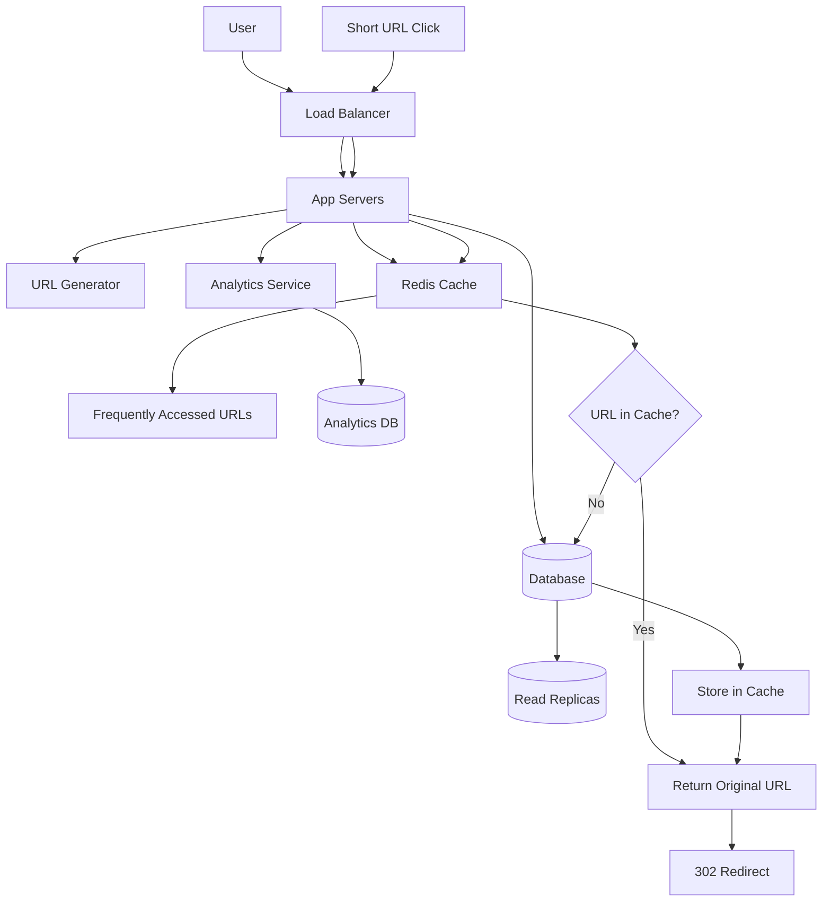
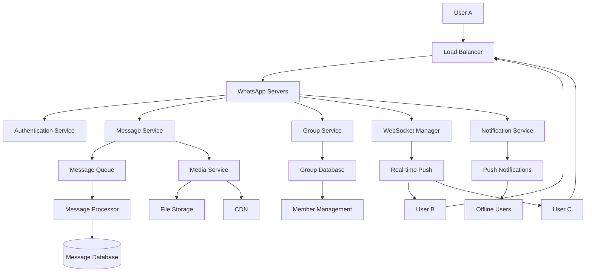
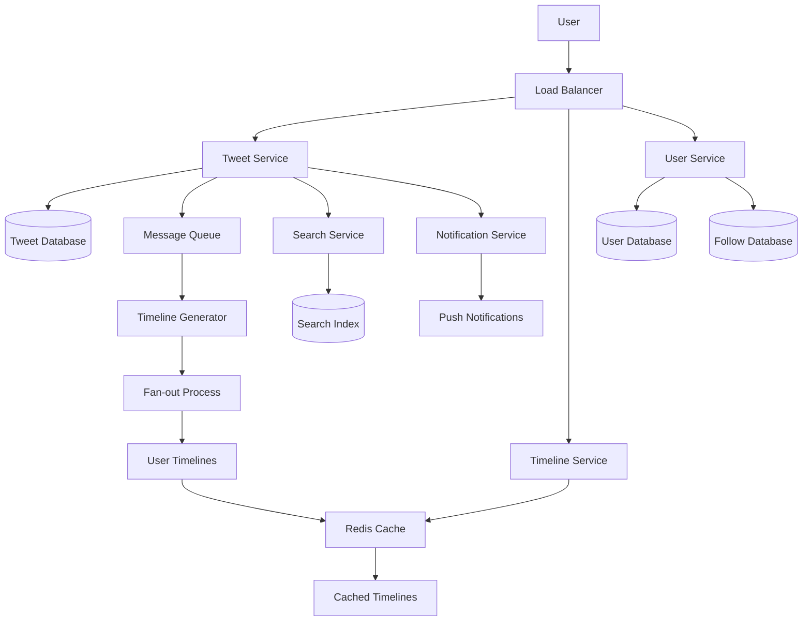
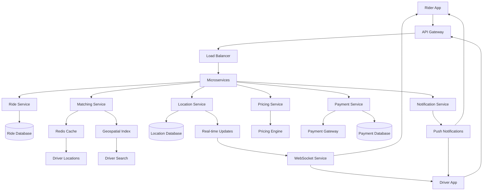
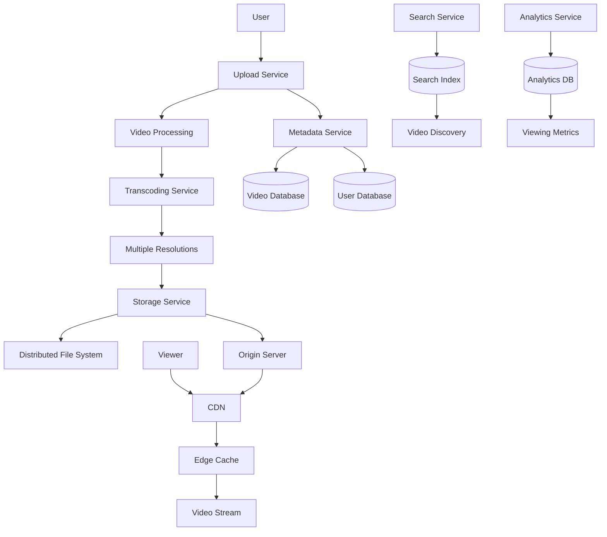
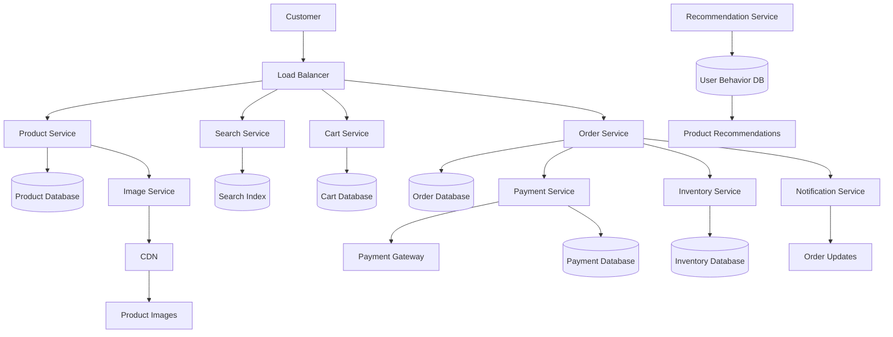
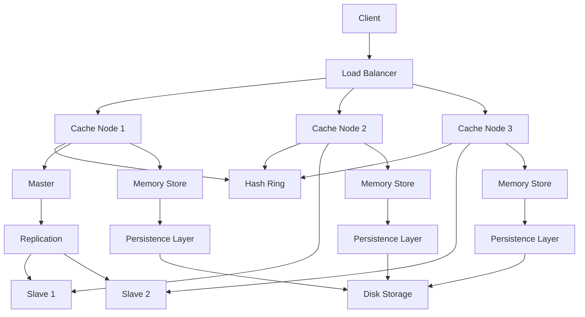

# Monchee Free System Design Pack
**By Monchee.com**
7 FAANG-Style Problems with Diagrams & Solutions

---

## Table of Contents

1. [URL Shortener](#problem-1-url-shortener)
2. [WhatsApp / Messenger](#problem-2-whatsapp--messenger)
3. [Twitter Feed](#problem-3-twitter-feed)
4. [Uber / Ride-Sharing](#problem-4-uber--ride-sharing)
5. [YouTube / Video Streaming](#problem-5-youtube--video-streaming)
6. [E-commerce Backend](#problem-6-e-commerce-backend)
7. [Distributed Cache (Redis-like)](#problem-7-distributed-cache-redis-like)

---

## Problem 1: URL Shortener

### Problem Statement
Design a URL shortener service like bit.ly that converts long URLs into short, shareable links. The service should handle millions of URL shortening requests per day and redirect users to the original URLs when they click on the short links.

### Functional Requirements
- **Shorten URLs**: Convert long URLs to short, unique identifiers
- **Redirect**: Redirect short URLs to original URLs
- **Custom URLs**: Allow users to create custom short URLs (optional)
- **Analytics**: Track click counts and basic usage statistics
- **Expiration**: Support optional URL expiration dates

### Non-Functional Requirements
- **High Availability**: 99.9% uptime
- **Low Latency**: Redirect should happen in < 100ms
- **Scalability**: Handle 100M URLs and 1000 requests/second
- **Durability**: Never lose URL mappings
- **Security**: Prevent abuse and malicious URLs

### Capacity Estimation
- **URLs per day**: 100M
- **Read/Write ratio**: 100:1 (mostly reads)
- **Storage**: 100M URLs × 500 bytes = 50GB per year
- **QPS**: 1000 writes/sec, 100K reads/sec

### High-Level Design
The system uses a simple but scalable architecture. When a user wants to shorten a URL, the request goes through a load balancer to one of many application servers. The server generates a unique short code using base62 encoding and stores the mapping in a database. For redirection, the system looks up the original URL and returns a 302 redirect.

### Detailed Design
- **URL Generator**: Uses base62 encoding (a-z, A-Z, 0-9) for 6-character codes
- **Database Schema**:
  ```sql
  CREATE TABLE url_mappings (
    id BIGINT PRIMARY KEY,
    short_code VARCHAR(6) UNIQUE,
    original_url TEXT,
    created_at TIMESTAMP,
    expires_at TIMESTAMP
  );
  ```
- **Caching**: Redis for frequently accessed URLs
- **Load Balancer**: Distributes traffic across application servers
- **Analytics**: Separate service for tracking clicks

### Bottlenecks & Trade-offs
- **Database bottleneck**: Use read replicas and caching
- **URL generation**: Pre-generate codes vs. generate on-demand
- **Custom URLs**: Additional validation and conflict resolution
- **Analytics**: Real-time vs. batch processing

### Improvements / Extensions
- **Geographic distribution**: CDN for global performance
- **Rate limiting**: Prevent abuse
- **URL validation**: Check for malicious URLs
- **Advanced analytics**: User demographics, referrer tracking
- **Bulk operations**: API for bulk URL shortening

### Diagram


---

## Problem 2: WhatsApp / Messenger

### Problem Statement
Design a real-time messaging system like WhatsApp that can handle billions of messages per day. The system should support one-on-one chats, group chats, message delivery status, and real-time message synchronization across multiple devices.

### Functional Requirements
- **Send Messages**: Send text, media, and file messages
- **Real-time Delivery**: Messages appear instantly on recipient's device
- **Group Chats**: Support group conversations with multiple participants
- **Message Status**: Show sent, delivered, and read status
- **Media Sharing**: Support images, videos, documents, and voice messages
- **Message History**: Store and retrieve chat history
- **Multi-device Sync**: Messages sync across all user devices

### Non-Functional Requirements
- **Low Latency**: Messages delivered in < 200ms
- **High Throughput**: Handle 50B+ messages per day
- **Scalability**: Support 2B+ users globally
- **Reliability**: 99.99% message delivery rate
- **Security**: End-to-end encryption for message privacy
- **Availability**: 99.9% uptime globally

### Capacity Estimation
- **Daily messages**: 50 billion
- **Peak QPS**: 1M messages/second
- **Storage**: 50B × 1KB = 50TB per day
- **Users**: 2 billion active users
- **Groups**: 100M groups with average 10 members

### High-Level Design
WhatsApp uses a hybrid architecture combining real-time messaging with traditional request-response patterns. When a user sends a message, it goes to the nearest WhatsApp server through a load balancer. The server authenticates the user, stores the message in a database, and immediately pushes it to the recipient's connected device via WebSocket connections.

### Detailed Design
- **Message Service**: Handles message creation, storage, and delivery
- **WebSocket Manager**: Manages real-time connections
- **Group Service**: Manages group membership and permissions
- **Media Service**: Handles file uploads and CDN distribution
- **Notification Service**: Sends push notifications to offline users
- **Message Queue**: Apache Kafka for high-volume message processing

### Bottlenecks & Trade-offs
- **WebSocket connections**: Scale horizontally with connection pooling
- **Message ordering**: Use sequence numbers and timestamps
- **Group messaging**: Fan-out approach vs. individual messages
- **Media storage**: CDN vs. direct storage
- **Offline users**: Store messages vs. real-time only

### Improvements / Extensions
- **Message encryption**: End-to-end encryption
- **Message search**: Full-text search capabilities
- **Voice/Video calls**: WebRTC integration
- **Message reactions**: Emoji reactions and replies
- **Message scheduling**: Send messages at specific times

### Diagram


---

## Problem 3: Twitter Feed

### Problem Statement
Design a Twitter-like social media feed system that can handle millions of users posting tweets and following each other. The system should display a personalized timeline showing tweets from followed users in reverse chronological order.

### Functional Requirements
- **Post Tweets**: Users can post text, images, and videos
- **Follow/Unfollow**: Users can follow other users
- **Timeline**: Display tweets from followed users
- **Like/Retweet**: Users can like and retweet posts
- **Search**: Search through tweets and users
- **Trending**: Show trending topics and hashtags
- **Notifications**: Notify users of interactions

### Non-Functional Requirements
- **Low Latency**: Timeline loads in < 200ms
- **High Throughput**: Handle 100M+ tweets per day
- **Scalability**: Support 500M+ users
- **Consistency**: Eventually consistent timeline
- **Availability**: 99.9% uptime

### Capacity Estimation
- **Daily tweets**: 100 million
- **Peak QPS**: 10K tweets/second
- **Users**: 500 million
- **Average followers**: 200 per user
- **Timeline reads**: 1B per day
- **Storage**: 100M × 1KB = 100GB per day

### High-Level Design
The system uses a hybrid approach combining push and pull models. For active users, we push tweets to their timeline cache. For inactive users, we generate timelines on-demand. The system includes separate services for tweets, users, timeline generation, and search.

### Detailed Design
- **Tweet Service**: Handles tweet creation, storage, and retrieval
- **User Service**: Manages user profiles and relationships
- **Timeline Service**: Generates personalized timelines
- **Search Service**: Full-text search through tweets
- **Notification Service**: Handles real-time notifications
- **Cache Layer**: Redis for timeline caching

### Bottlenecks & Trade-offs
- **Timeline generation**: Push vs. pull model
- **Fan-out**: Handle users with millions of followers
- **Search**: Real-time vs. batch indexing
- **Media storage**: CDN vs. direct storage
- **Caching**: Memory vs. disk storage

### Improvements / Extensions
- **Machine learning**: Personalized timeline ranking
- **Real-time updates**: WebSocket for live timeline
- **Advanced search**: Filter by date, user, media type
- **Analytics**: Tweet performance metrics
- **Content moderation**: Automated content filtering

### Diagram


---

## Problem 4: Uber / Ride-Sharing

### Problem Statement
Design a ride-sharing platform like Uber that connects riders with drivers in real-time. The system should handle ride requests, driver matching, real-time location tracking, fare calculation, and payment processing.

### Functional Requirements
- **Ride Request**: Allow riders to request rides with pickup and destination
- **Driver Matching**: Match riders with nearby available drivers
- **Real-time Tracking**: Show driver location and ETA in real-time
- **Fare Calculation**: Calculate dynamic pricing based on demand and distance
- **Payment Processing**: Handle secure payment transactions
- **Driver Management**: Allow drivers to go online/offline and manage rides
- **Rating System**: Rate drivers and riders after ride completion

### Non-Functional Requirements
- **Low Latency**: Driver matching in < 2 seconds
- **High Availability**: 99.9% uptime during peak hours
- **Scalability**: Support 10M+ daily rides globally
- **Real-time Updates**: Location updates every 2-3 seconds
- **Security**: Secure payment processing and user data protection

### Capacity Estimation
- **Daily rides**: 10 million
- **Peak QPS**: 100K requests/second
- **Drivers**: 2 million active drivers
- **Riders**: 50 million active riders
- **Location updates**: 1B per day
- **Storage**: 10M rides × 2KB = 20GB per day

### High-Level Design
Uber's architecture is built around microservices handling different aspects of the ride-sharing experience. When a rider requests a ride, the request goes to the matching service which uses geospatial indexing to find nearby available drivers. The system uses Redis for real-time driver location caching and Apache Kafka for event streaming.

### Detailed Design
- **Ride Service**: Handles ride requests and lifecycle management
- **Matching Service**: Finds nearby drivers using geospatial algorithms
- **Location Service**: Tracks and updates driver locations
- **Pricing Service**: Calculates dynamic fares based on demand
- **Payment Service**: Processes payments and handles refunds
- **Notification Service**: Sends real-time updates to users

### Bottlenecks & Trade-offs
- **Driver matching**: Geospatial indexing vs. simple distance calculation
- **Location updates**: Real-time vs. batch processing
- **Pricing**: Dynamic vs. static pricing
- **Payment processing**: Synchronous vs. asynchronous
- **Data consistency**: Strong vs. eventual consistency

### Improvements / Extensions
- **Machine learning**: Better driver-rider matching
- **Surge pricing**: Advanced demand prediction
- **Route optimization**: Real-time traffic data integration
- **Multi-modal**: Support for different vehicle types
- **Scheduling**: Pre-scheduled rides

### Diagram


---

## Problem 5: YouTube / Video Streaming

### Problem Statement
Design a video streaming platform like YouTube that can handle millions of users uploading, processing, and streaming videos. The system should support video upload, transcoding, storage, and streaming to users worldwide.

### Functional Requirements
- **Video Upload**: Users can upload videos of various formats
- **Video Processing**: Transcode videos to multiple resolutions
- **Video Streaming**: Stream videos to users with adaptive bitrate
- **Video Discovery**: Search and recommend videos to users
- **User Management**: User profiles, subscriptions, and playlists
- **Comments/Likes**: Users can comment and like videos
- **Live Streaming**: Support live video streaming

### Non-Functional Requirements
- **Low Latency**: Video starts playing in < 2 seconds
- **High Throughput**: Handle 100M+ video views per day
- **Scalability**: Support 2B+ users globally
- **Quality**: Adaptive bitrate streaming for different network conditions
- **Availability**: 99.9% uptime globally

### Capacity Estimation
- **Daily uploads**: 1 million videos
- **Daily views**: 100 million
- **Peak QPS**: 50K concurrent streams
- **Storage**: 1M videos × 100MB = 100TB per day
- **Bandwidth**: 100M views × 2MB = 200TB per day
- **Users**: 2 billion

### High-Level Design
The system uses a multi-tier architecture with separate services for upload, processing, storage, and streaming. Videos are transcoded into multiple resolutions and stored in a distributed file system. A CDN is used for global video delivery with edge caching.

### Detailed Design
- **Upload Service**: Handles video uploads and initial processing
- **Transcoding Service**: Converts videos to multiple formats/resolutions
- **Storage Service**: Manages video files in distributed storage
- **Streaming Service**: Delivers videos with adaptive bitrate
- **CDN**: Global content delivery network
- **Metadata Service**: Stores video metadata and user data

### Bottlenecks & Trade-offs
- **Video processing**: CPU-intensive transcoding
- **Storage**: Cost vs. performance for video files
- **Bandwidth**: CDN vs. direct streaming
- **Transcoding**: Real-time vs. batch processing
- **Caching**: Edge caching vs. origin storage

### Improvements / Extensions
- **AI/ML**: Content recommendation and moderation
- **Live streaming**: Real-time video processing
- **VR/360 videos**: Specialized video formats
- **Analytics**: Detailed viewing analytics
- **Monetization**: Ad insertion and subscription management

### Diagram


---

## Problem 6: E-commerce Backend

### Problem Statement
Design the backend system for an e-commerce platform like Amazon that can handle millions of products, users, and orders. The system should support product catalog, shopping cart, order processing, payment, and inventory management.

### Functional Requirements
- **Product Catalog**: Browse and search products
- **Shopping Cart**: Add/remove items from cart
- **Order Processing**: Place and track orders
- **Payment Processing**: Handle secure payments
- **Inventory Management**: Track product stock levels
- **User Management**: User accounts, profiles, and preferences
- **Reviews/Ratings**: Product reviews and ratings

### Non-Functional Requirements
- **High Availability**: 99.9% uptime during peak shopping seasons
- **Scalability**: Handle 10M+ products and 100M+ users
- **Performance**: Page loads in < 2 seconds
- **Security**: Secure payment processing and user data
- **Consistency**: Inventory and order consistency

### Capacity Estimation
- **Products**: 10 million
- **Users**: 100 million
- **Daily orders**: 1 million
- **Peak QPS**: 100K requests/second
- **Storage**: 10M products × 1KB = 10GB metadata
- **Images**: 10M products × 5 images × 500KB = 25TB

### High-Level Design
The system uses a microservices architecture with separate services for products, users, orders, payments, and inventory. A search service handles product discovery, while a recommendation engine suggests products to users.

### Detailed Design
- **Product Service**: Manages product catalog and details
- **Search Service**: Full-text search and filtering
- **Cart Service**: Shopping cart management
- **Order Service**: Order processing and tracking
- **Payment Service**: Payment processing and refunds
- **Inventory Service**: Stock level management
- **Recommendation Service**: Product recommendations

### Bottlenecks & Trade-offs
- **Search performance**: Real-time vs. batch indexing
- **Inventory consistency**: Optimistic vs. pessimistic locking
- **Payment processing**: Synchronous vs. asynchronous
- **Image storage**: CDN vs. direct storage
- **Caching**: Product data vs. user data

### Improvements / Extensions
- **Machine learning**: Personalized recommendations
- **Real-time analytics**: Live sales and inventory tracking
- **Multi-vendor**: Support for multiple sellers
- **Mobile app**: Native mobile applications
- **International**: Multi-currency and shipping

### Diagram


---

## Problem 7: Distributed Cache (Redis-like)

### Problem Statement
Design a distributed caching system like Redis that can handle millions of operations per second with high availability and consistency. The system should support various data structures and provide sub-millisecond latency.

### Functional Requirements
- **Data Structures**: Support strings, hashes, lists, sets, sorted sets
- **Operations**: GET, SET, DELETE, and complex operations
- **Persistence**: Optional data persistence to disk
- **Replication**: Master-slave replication for high availability
- **Clustering**: Horizontal scaling across multiple nodes
- **Expiration**: TTL support for automatic key expiration

### Non-Functional Requirements
- **Low Latency**: Sub-millisecond response times
- **High Throughput**: 1M+ operations per second
- **Availability**: 99.99% uptime
- **Consistency**: Configurable consistency levels
- **Scalability**: Scale to thousands of nodes

### Capacity Estimation
- **Operations per second**: 1 million
- **Memory per node**: 32GB
- **Total memory**: 1TB across cluster
- **Keys**: 1 billion
- **Average key size**: 1KB
- **Peak memory usage**: 80%

### High-Level Design
The system uses a distributed hash table (DHT) to partition data across multiple nodes. Each node handles a subset of the key space and replicates data to other nodes for fault tolerance. A consistent hashing algorithm ensures even distribution and minimal data movement during scaling.

### Detailed Design
- **Hash Ring**: Consistent hashing for key distribution
- **Node Management**: Automatic node addition/removal
- **Replication**: Master-slave replication with failover
- **Memory Management**: LRU eviction and memory optimization
- **Persistence**: RDB snapshots and AOF logging
- **Client Library**: Connection pooling and load balancing

### Bottlenecks & Trade-offs
- **Memory vs. Disk**: In-memory vs. disk-based storage
- **Consistency vs. Availability**: CAP theorem trade-offs
- **Replication**: Synchronous vs. asynchronous
- **Sharding**: Hash-based vs. range-based partitioning
- **Eviction**: LRU vs. LFU vs. random

### Improvements / Extensions
- **Geographic distribution**: Multi-region clusters
- **Advanced data structures**: HyperLogLog, Bloom filters
- **Streaming**: Real-time data streaming capabilities
- **Machine learning**: Predictive caching
- **Security**: Encryption and access control

### Diagram


---

## Conclusion

This System Design Interview Pack provides comprehensive coverage of the most commonly asked system design questions in FAANG interviews. Each problem includes:

- **Clear problem statements** and requirements
- **Detailed capacity estimations** and scaling considerations
- **High-level and detailed designs** with trade-offs
- **Professional Mermaid diagrams** showing system architecture
- **Bottlenecks and improvements** for advanced discussions

Use this pack to prepare for system design interviews by understanding the patterns, trade-offs, and scaling considerations that apply across different types of systems.

**Good luck with your interviews!**

---

*Built with ❤️ by the Monchee team*
*Visit us at [monchee.com](https://monchee.com)*
